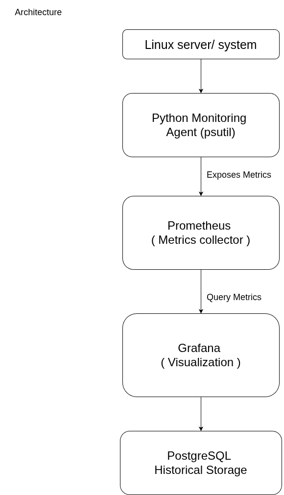
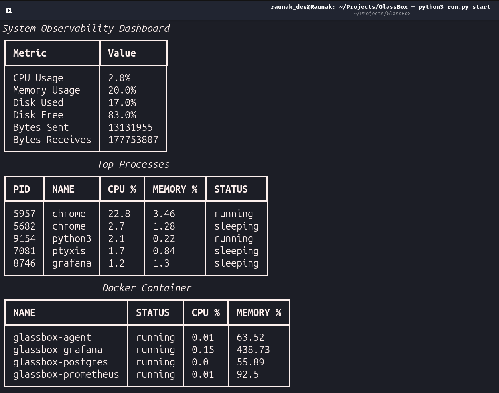
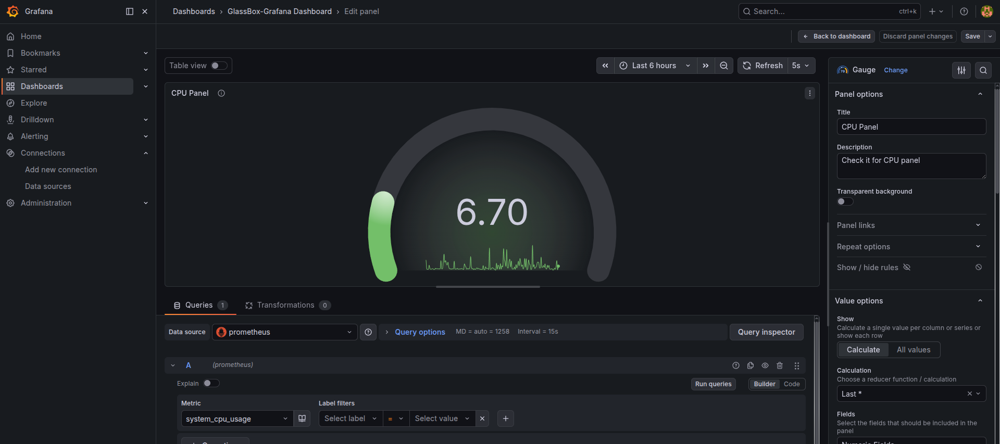
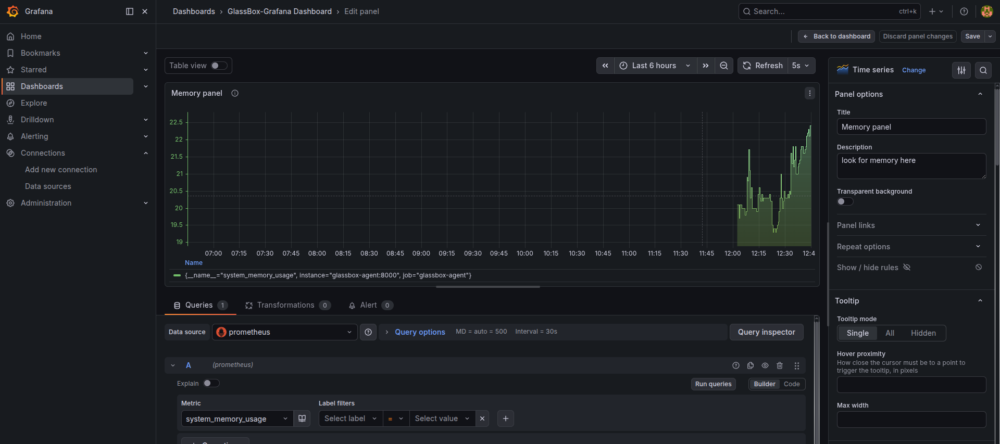
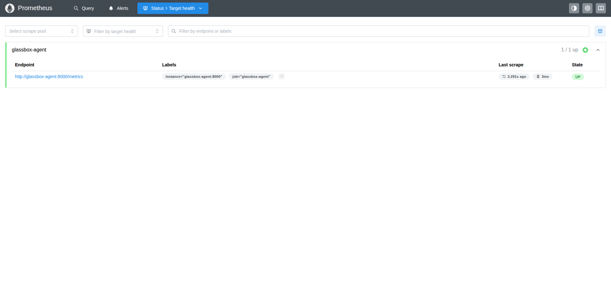
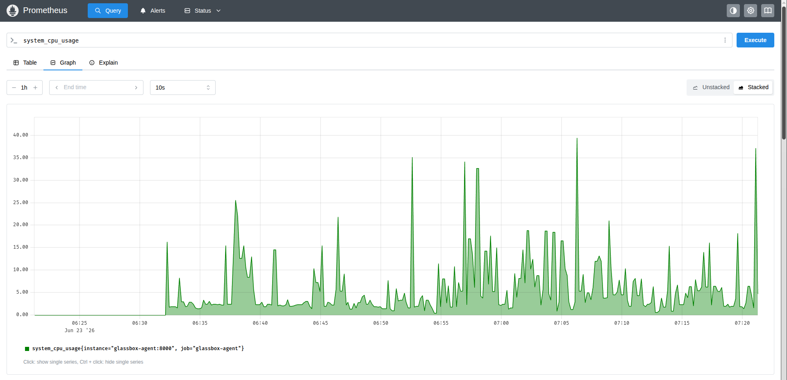
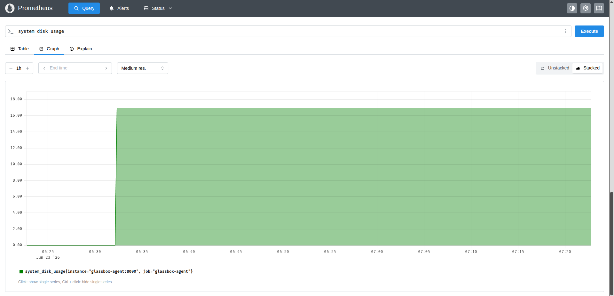
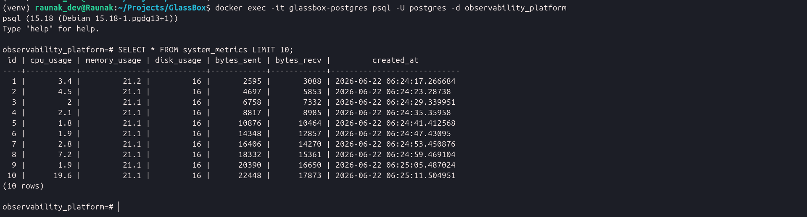
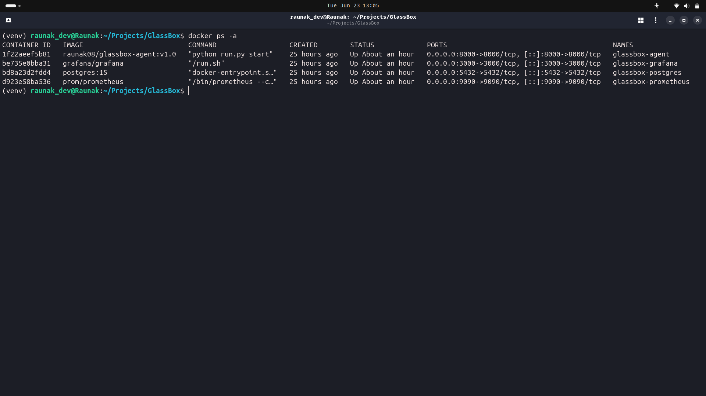

# 🚀 GlassBox

> Real-time observability and monitoring platform built with Python, Prometheus, Grafana, Docker and PostgreSQL. 

GlassBox is a containerized observability platform designed to monitor system health, processes, Docker containers, and infrastructure telemetry in real time. It combines live terminal monitoring with Prometheus metrics scraping and Grafana visualization to create a complete monitoring pipeline.

---

# 📌 Features

### ✅ System Monitoring

> Continuously collects and tracks system-level metrics including CPU, memory, disk usage, and network statistics to provide real-time infrastructure visibility.

### ✅ Process Monitoring

>Monitors active processes and resource consumption, helping identify high CPU or memory-consuming applications on the host system.

### ✅ Docker Monitoring

>Integrates with the Docker Engine to track running containers and monitor container-level resource utilization.

### ✅ Live Terminal Dashboard

>Provides a real-time terminal-based dashboard built with Rich, offering an interactive view of system health, processes, and container activity.

### ✅ Observability Stack

>Exports metrics through Prometheus and enables real-time visualization and analysis using Grafana dashboards.

### ✅ Historical Metrics Storage

>Stores monitoring data in PostgreSQL for persistence, enabling historical analysis and future reporting capabilities.

### ✅ Alerting & Logging

>Generates threshold-based alerts and maintains structured logs for monitoring events, warnings, and operational insights.

### ✅ Containerized Architecture

>Runs as a multi-container application orchestrated with Docker Compose, simplifying deployment and service management.


---

# 🏗️ Architecture

```text
+-------------------+
| Linux Server /    |
|       System      |
+---------+---------+
          |
          v
+-------------------+
| Python Monitoring |
|  Agent (psutil)   |
+---------+---------+
          |Expose Metrics
          v
+-------------------+
|      Prometheus   |    
|(Metrics Collector)|
+---------+---------+
          | Query Metrics
          v
+-------------------+
|    Grafana        |
|  (Visualization)  |
+---------+---------+
          |
          v
+-------------------+
|   PostgreSQL      |
|Historical Storage |
+-------------------+
```

---

# 🛠️ Tech Stack

| Technology     | Purpose                       |
| -------------- | ----------------------------- |
| Python         | Core monitoring engine        |
| psutil         | System and process metrics    |
| Rich           | Live terminal dashboard       |
| Docker         | Container monitoring          |
| Prometheus     | Metrics scraping              |
| Grafana        | Dashboard visualization       |
| PostgreSQL     | Persistent metrics storage    |
| Docker Compose | Multi-container orchestration |


---

## 📂 Project Structure

```plaintext
GlassBox/
│
├── assets/                     # README screenshots and project visuals
│
├── glassbox/
│   ├── alert/                  # Alert management and threshold checks
│   ├── dashboard/              # Rich terminal dashboard components
│   ├── database/               # PostgreSQL integration
│   ├── docker_monitoring/      # Docker container monitoring
│   ├── exporters/              # Prometheus metrics exporter
│   ├── logs/                   # Logging utilities
│   ├── metrics/                # System and process metrics collection
│   ├── monitoring/             # Monitoring engine and orchestration
│   └── prometheus/             # Prometheus configuration
│
├── venv/                       # Python virtual environment (local)
│
├── .dockerignore
├── .gitignore
├── docker-compose.yml          # Multi-container stack definition
├── Dockerfile                  # GlassBox container image
├── LICENSE
├── README.md
├── requirements.txt
└── run.py                      # Application entry point
```
---

# 🐳 Multi-Container Stack

GlassBox runs as a containerized observability stack:

| Container	           | Purpose                     |
| -------------------  | -------------------------   |
| glassbox-agent	   | Monitoring engine           |
| glassbox-prometheus  | Metrics scraping            |
| glassbox-grafana	   | Visualization dashboards    |
| glassbox-postgres	   | Persistent storage          |

---

# ▶️ Installation & Setup

Clone repository:

```bash
git clone https://github.com/Raunak08-code/GlassBox.git

cd GlassBox
```

Move into project folder:

```bash
python -m venv venv

source venv/bin/activate
```

Install dependencies:

```bash
pip install -r requirements.txt
```
 
▶️ Run GlassBox Locally

```bash
python run.py start
```

🐳 Run Using Docker Compose

Start Full Stack:

```bash
docker compose up --build
```
Run in Background:

```bash
docker compose up --build -d
```

Stop Stack:

```bash
docker compose down
```

---

# 📊 Access Services

| Services          | URL                            |
| ----------------- | ------------------------------ |
| Prometheus        | http://localhost:9090          |
| Grafana           | http://localhost:3000          |
| Metrics Exporter  | http://localhost:8000/metrics  |

---

### 📈 Grafana Setup

Default Credentials 
```bash
username: admin
passward: admin
```
Add Prometheus Data Source
use:
```bash
http://prometheus:9090
```
### 📡 Prometheus Metrics

GlassBox exports metrics such as:
```bash
system_cpu_usage
system_memory_usage
system_disk_usage
```
These metrics are scraped by Prometheus and visualized in Grafana.

---

# 📸 Screenshots

## Architecture

Project Architecture..



---

## Terminal Dashboard

Real-time monitoring dashboard built using Rich.



---

## Grafana Dashboard

Unified observability dashboard powered by Prometheus and Grafana.


---

## CPU Monitoring Panel



---

## Memory Monitoring Panel



---

## Prometheus Target Status

Prometheus successfully scraping GlassBox metrics exporter.



---

## Prometheus CPU Query

Metric verification using PromQL.



---

## Prometheus Memory Query


---

## Prometheus Disk Query



---

## PostgreSQL Metrics Storage

Historical metrics persisted inside PostgreSQL.



---

## Running Containers

Complete observability stack running with Docker Compose.



---

# 🧠 Engineering Concepts Learned

GlassBox demonstrates practical understanding of:
- Observability pipelines
- Metrics collection
- Prometheus exporters
- Time-series monitoring
- Grafana dashboards
- Docker networking
- Multi-container orchestration
- Runtime debugging
- Infrastructure monitoring
- Process telemetry
- Service dependency management
- Structured logging

---

# 🚀 Future Improvements

- Alert notification (slack/Discard/Email)
- Historical analytics dashboard
- Kubernetes monitoring
- Anomaly detection
- Service health APIs
- Distributed tracing integration
- Log aggregation pipline

---

# 🧪 Example Commands

View Running Containers
```bash
docker ps
```

View Container Logs
```bash
docker logs glassbox-agent
```

Check Prometheus Targets
```bash
http://localhost:9090/targets
```
---

# 📌 Version

Current Release:    v1.0

---

# 📜 License

This project is licensed under the MIT License.

---

# 👨‍💻 Author

Raunak Pandey
B.Tech CSE (AI)

# ⭐ GlassBox
A lightweight yet powerful observability platform for real-time infrastructure monitoring, telemetry collection, and system visualization.
